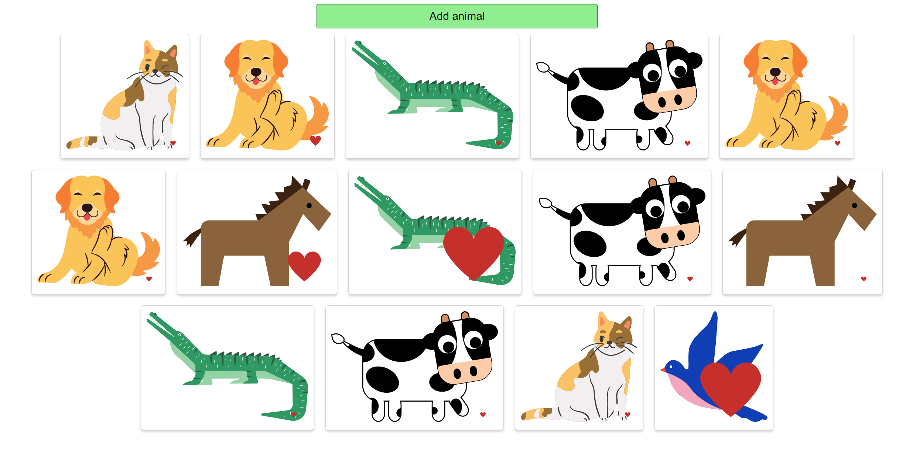

# Animals with like functionality

#### By: Viktoria Zubarieva

#### Description

React application where user can add picture of animal and as he/she clicks on animal the heart picture("like") is growing bigger. This app was made with educational purposes. 

## Technologies Used

- React
- JavaScript
- CSS
- HTML

## Setup/Installation Requirements

- _Clone repository from GitHub_
- _Open your terminal and run the command $ git clone https://github.com/vzubarieva/Like-animal-app_
- Navigate to "animals"
- Open in code editor (VS Code)
- Install dependencies: $ npm install
- Run Program $ npm run start ( It should open the server http://localhost:3000/ )

## Known Bugs

The heart can be very big.

## License

_MIT_

Copyright (c) _2023_ _Viktoriia Zubarieva_
